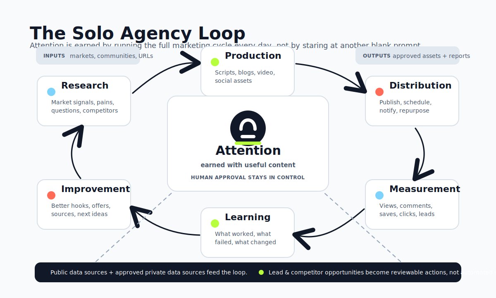

<p align="center">
  
</p>

# Solo Agency

Tell your AI agent: "Setup https://github.com/soloagency/solo-agency now" to turn it into a real marketing team that works every morning: research, lead and competitor opportunities, videos, blogs, distribution, analytics, and improvements, ready for your approval.

## The Point

Founder note:

I learned the hard way: when you are solo, the hardest problem is attention. Attention Is All You Need, but attention has to be earned with content people actually care about. That means daily research, production, distribution, measurement, and improvement, not another blank prompt.

- Content without research is guessing.
- Research without production is wasted.
- Production without distribution is invisible.
- Distribution without measurement is gambling.
- Measurement without learning is busywork.
- Learning without improvement is entertainment.

This playbook connects the full agency loop: research, ideas, lead and competitor opportunities, scripts, production, distribution, measurement, learning, and improvement.



## What This Is

- An AI-agent operating playbook for daily content intelligence across one client or an entire client roster.
- A marketing workflow: research -> insight -> content pillar -> idea -> script/blog/social -> approval -> production -> distribution -> analytics -> learning.
- A public data source + private data source intelligence system across Google, industry sites, FB, IG, YT, TT, X, LinkedIn, Reddit, groups, pages, creators, and communities.
- Helps scan and evaluate private data sources you already have, such as joined Facebook groups, joined/subscribed subreddits, followed pages/KOLs, subscribed channels, and community feeds.
- A pain-point-to-content-pillar engine that turns real audience problems into daily content angles.
- A lead and competitor opportunity engine built directly into the research process: it finds relevant posts, preserves source links, explains why each signal matters, and drafts value-first comments for human review.
- A production layer for idea-to-video, blog/social creation, auto-posting, notifications, analytics, and build-measure-learn-improve loops.
- A multi-client workflow for freelancers and agencies that need repeatable output without rebuilding strategy from scratch every morning.

## Maintainer Pre-Upload

Before pushing or uploading this repo to GitHub, run:

```sh
./deploy-soloagency.sh
```

This formats/tests the Go Local Collector bridge, cross-builds the prebuilt bridge binaries, rebuilds collector zip artifacts, refreshes `SHA256SUMS`, rebuilds playbook skill zips, removes `.DS_Store`, and runs upload preflight checks. Maintainers need Go installed; end users do not.

## What You Get Every Day

- A client-ready HTML report with insights, proof, recommendations, and next actions.
- Source-backed content ideas with URLs, not generic AI brainstorming.
- The best idea of the day, selected by freshness, audience pain, lead potential, business impact, and offer relevance.
- A global/local idea matrix across Hot / Trend / News, Evergreen / Foundation, and Lead-Gen / Conversion.
- Related-industry angles clearly labeled and connected back to the client's offer.
- 5 production-ready draft angles: Value Explainer, Client Q&A, Myth Buster, Mistake Prevention, and Lead-Gen CTA.
- When approved and connected, the agent can turn those drafts into actual video, blog, and social assets through production tools.
- Lead & Competitor Opportunities with source links, post URLs when visible, context, why it matters, and a copy-ready value-first comment for each opportunity.
- Hot/warm/watch lead signals, including direct needs, indirect pain signals, objections, complaints, buying triggers, and adjacent needs.
- Competitor intelligence across direct, indirect, adjacent, attention, and authority/KOL competitors, including hooks, offers, positioning, audience overlap, and useful places to show up.
- New source opportunities, such as groups, pages, creators, communities, or competitor profiles worth monitoring.
- A clear production path: approve, revise, choose another idea, create a video, publish, schedule, reconnect, or measure.

## Built For Solo Operators, Useful For Agencies

- Serve more clients without opening a blank doc every morning.
- Build content from real market demand, not vibes.
- Convert audience pain points into content pillars, scripts, blogs, and social angles.
- Turn private community chatter into lead-gen angles, objections to answer, and timely comments.
- Use competitor activity to understand positioning, offers, audience overlap, and useful places to show up.
- Spot hot/warm/watch leads during normal content research, with source links and copy-ready value-first comments.
- Keep each client separated by profile, sources, reports, history, analytics, and learning.
- Add clients one by one as the agency grows.
- Run one client, ten clients, or every active client on a schedule.
- Keep humans in control of approvals, publishing, rendering, outreach, and spending.

## Private Data Source Intelligence

Important: the Local Collector is not the setup entrypoint. It is a private data source module used only after the main playbook reaches the private data source stage and the human approves collector activation.

- Monitors logged-in private data sources such as FB groups/pages, IG profiles, YT channels/comments, TT accounts, X accounts, LinkedIn pages, Reddit communities, competitor pages, fanpages, and niche forums.
- If the user has no list yet, recommends private data source discovery instead of silently skipping this layer. The agent can review candidate Facebook groups, subreddits, communities, followed KOLs/pages, creator profiles, subscribed channels, and recommendation feeds the user approves.
- Lets the user provide private data sources manually, approve AI-discovered candidates, or do both.
- Filters candidate sources by relevance, activity, pain-point match, target-audience fit, lead potential, competitor intelligence value, noise, and account-safety risk before asking the user to approve them.
- Uses the user's existing logged-in Chrome session through the Solo Agency Local Collector extension and Local Collector app. Private data stays local on the user's computer by default.
- Does not use Claude in Chrome, Codex/browser tools, Playwright, or agent-controlled browsers to read logged-in private data sources.
- Never asks for passwords, cookies, OTPs, tokens, or raw credentials.
- Updates the report, idea matrix, best idea, Lead & Competitor Opportunities, and drafts after private scans, instead of stopping at "collector succeeded."

## Production, Distribution, And Learning

- Turns approved ideas or scripts into videos through connected production tools.
- Creates approved video, blog, and social assets when the production provider is configured and the human has approved the action.
- Supports faceless, face-clone, and teleprompter-style production when configured.
- Repurposes one approved idea into video, blog, and social formats.
- Publishes approved content to connected channels when authorized by the human.
- Sends report, blocker, approval, publishing, and session-refresh notifications through available notification providers.
- Encourages a free WideCast + Telegram setup so daily report links and blockers can reach the human remotely, without sitting in front of the computer.
- Measures content through connected analytics tools and visible platform metrics when available.
- Tracks views, likes, comments, shares, saves, clicks, follower growth, and unavailable metrics honestly.
- Updates hook learnings, CTA learnings, content-pillar scores, source priority, experiment backlog, and future idea selection.
- Completes the loop: build -> measure -> learn -> improve.

## Media Tool Integrations

Connect specialist tools such as Google Veo, Seedance, Kling, Nano Banana, Shutterstock, Pexels, Pixabay, HeyGen, and similar media services for production assets.

WideCast can be used as one maintained all-in-one path for writing, video production, publishing, notifications, analytics, and learning loops. It is not required for research, idea generation, lead detection, report generation, or account-free draft writing.

## Best First Prompt

```text
Setup https://github.com/soloagency/solo-agency now.
```

The main playbook tells the agent which detailed stage playbook to load next. If the `playbooks/` folder is not local, the agent can fetch the needed stage file from this GitHub repo.

## Best New Client Prompt

```text
Add a new client: [client name].
They provide [product/service/profession/expertise].
Their target market is [location if known].
Here are optional private data sources to monitor: [URLs].
You may also ask me whether to discover private data sources from my joined groups, subreddits, followed profiles/KOLs, subscriptions, and feeds.
Set up the client-specific automation task for the first report using public data sources. Do not run the report inside the setup chat.
```

## Agent Compatibility

Tested with Claude Desktop, Codex, Hermes, and OpenClaw.

Community testing on other AI agents is welcome, especially around playbook loading, local collector setup, scheduled runs, progress display, and HTML report delivery.

No vision model is required. Solo Agency is designed to run with an LLM-only agent. 

## Agent Entry Point

If you are an AI agent setting up this repo, start here:

1. Read `SOLO_AGENCY_PLAYBOOK.md` first.
2. Follow the checklist in that file in order.
3. Do not install, start, or configure `solo-agency-collector/` first.
4. The Local Collector is activated only later if the playbook reaches the private data source stage and the human approves it.
5. Use the canonical terms `public data sources` and `private data sources`. Do not shorten them, omit `data`, or use slash labels.
6. If the human asks to scan or monitor private data sources (logged-in groups, feeds, profiles, communities, or social sources) after the conversation has drifted, reload `playbooks/PRIVATE_SOURCE_GATE.md`, `playbooks/02_PRIVATE_SOURCE_SETUP.md`, `playbooks/08_LOCAL_COLLECTOR_TECHNICAL_PROTOCOL.md`, and `playbooks/09_AGENCY_OPERATIONS_SAFETY_AUDIT.md` before taking action.
7. Never use Claude in Chrome, Claude Chrome Extension, Codex built-in/in-app browser, Playwright/Puppeteer/Selenium, a fresh agent-opened browser profile, or any agent-controlled browser to read private data sources. Use only the Solo Agency Local Collector extension plus the Local Collector app.
8. During Local Collector activation, do not run `setup_collector.sh`, PowerShell setup scripts, `.cmd` launchers, or collector binaries from inside the AI agent. Prepare the files, then give the human the one-line Terminal/PowerShell command to run outside the AI sandbox and the Chrome extension `Load unpacked` folder path.
9. When checking an already-running Local Collector app, do not trust `ready` alone. Verify `/status.config_file`, `/status.output_dir`, and `/status.run_now_request_file` point to the current setup's `daily-content-pipeline/collector/` tree. If they point to another setup, treat it as `wrong_workspace_bridge`, ask the human to run the current setup's Local Collector command, and remind them to remove/disable old Solo Agency Local Collector extensions in `chrome://extensions`.
10. After a schedule/automation exists, every later approved change must trigger Automation Resync across the whole automation package, not only one config file. Update profile/source state, `schedule.md`, collector config when relevant, automation manifest, scheduled-run prompt/task body, and the resync log before saying the next scheduled run is updated.
11. Every human-facing progress block after schedule/automation exists must include an Automation freshness check: whether the latest changes were synced into the automation/scheduled task prompt/contract/playbook/source state, not only config, and whether tomorrow's scheduled run will load the newest state.
12. Every scheduled/manual report handoff must include a Report Delivery Capability Check outcome: WideCast upload/notification tools checked, upload/Telegram attempted when available, uploaded URL or exact blocker logged, and final HTML report path/link delivered.

The repo entrypoint is `SOLO_AGENCY_PLAYBOOK.md`, not `solo-agency-collector/`.
